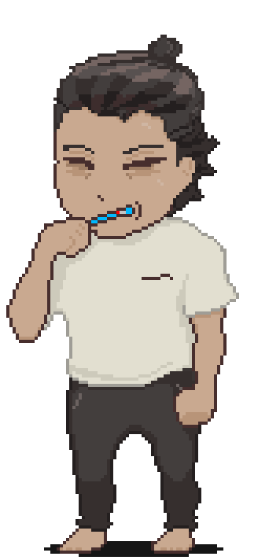
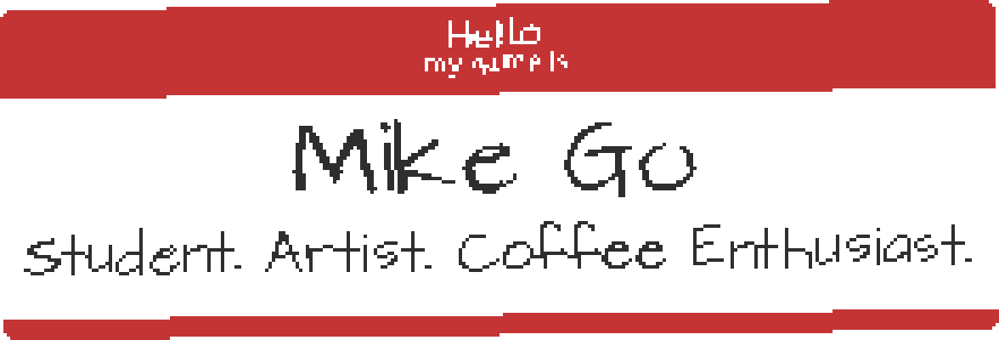

b<!-- !DOCTYPE HTML -->

<header>
</header>

<body>

  

    

  
Student in Software Engineering, Java Track @ <a href="https://www.wgu.edu/online-it-degrees/software-engineering-bachelors-program.html" title="WGU">WGU</a>.

As of January 2024, I am working to get my B.S. in Software Engineering. 🌱

My interests with coding is game development, Automotive CAN BUS development, and microcontroller development.
I have limited experience with robot trading. Interested in 3D Printing and Robotics. 

#### Learning / Previously Used

#### Socials

 <a href="https://www.linkedin.com/in/michael-go-82a95a113/" target="_blank" rel="noreferrer"> <picture> <source media="(prefers-color-scheme: dark)" srcset="https://raw.githubusercontent.com/danielcranney/readme-generator/main/public/icons/socials/linkedin-dark.svg" /> <source media="(prefers-color-scheme: light)" srcset="https://raw.githubusercontent.com/danielcranney/readme-generator/main/public/icons/socials/linkedin.svg" />  </picture> </a>

#### Cup of Kofi?

<ul style="list-style-type: none; margin: 0;">

<li style="display: inline-block; margin-right: 0.25rem;"></li>

</ul>

📫 Reach me via email.

Notable Achievements, Chronological

<ul>
  <li>Opened working and dysfunctional toys and machines to see how it works</li>
  <li>Edited HTML on myspace when it was popular</li>
  <li>played around with a Raspberry Pi Controller, changed LED lights.</li>
  <li>played with Unity/Godot game engines and Blender for 3D modeling</li>
  <li>Made a disfunctional DnD tool using GDevelop (C++, Javascript No Coding) on Itch.io , connecting it to Heroku and Node.js for multiplayer</li>
  <li>Passed an entrance test for GA (General Assembly) Bootcamp, which only asked for High School level HTML/CSS/JAVA knowledge. </li>
  <li>Certified for Google IT Support as of 2023.</li>
  <li>Enrolled in WGU College for Software Engineering.</li>
</ul>

  </body>

<!--
**Greiye/Greiye** is a repository because its `README.md` (this file) appears on your GitHub profile.
Here are some ideas to get you started:

- 🔭 I’m currently working on ...
- 🌱 I’m currently learning ...
- 👯 I’m looking to collaborate on ...
- 🤔 I’m looking for help with ...
- 💬 Ask me about ...
- 📫 How to reach me: ...

-->
